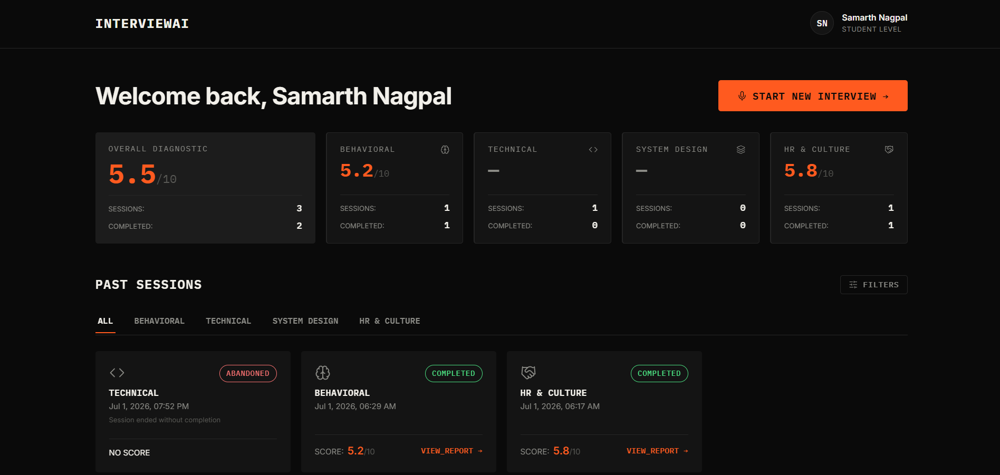
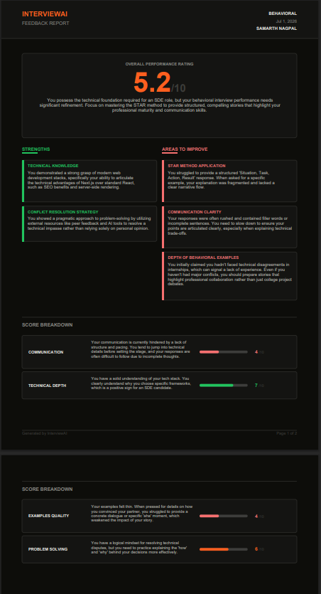

# InterviewAI — AI Mock Interview Platform

A production-grade, stateful AI Mock Interview Platform featuring real-time voice conversations powered by LangGraph, Vapi, and AssemblyAI, with automated feedback reporting and performance diagnostics.

---

## Screenshots




---

## Tech Stack

| Layer | Technology |
|---|---|
| **Frontend** | React 18, Vite, CSS (Dark terminal-style UI) |
| **Backend** | Node.js, Express |
| **Database** | PostgreSQL (raw `pg` driver) |
| **Auth** | JWT + bcrypt (Email + Password, no OAuth) |
| **Voice Interface** | Vapi (Custom LLM mode) |
| **STT (Speech-to-Text)** | AssemblyAI Universal-Streaming |
| **Transactional Email** | Brevo (formerly Sendinblue) SMTP for password resets |

---

## Architecture & Data Flow

The platform uses a stateful architecture managed by LangGraph. Under the hood, a candidate's spoken turn is captured, processed, and responded to dynamically without hardcoded questions.

```
                  ┌────────────────────────────────────────┐
                  │                 Vapi                   │
                  │  (Captures audio & streams to STT)     │
                  └───────────┬────────────────┬───────────┘
                              │                ▲
  HTTP POST (JSON transcript) │                │ HTTP Response (JSON instructions)
                              ▼                │
                  ┌────────────────────────────┴───────────┐
                  │            Express Backend             │
                  │   (Validates webhooks & state)         │
                  └───────────┬────────────────▲───────────┘
                              │                │
            loads state from  │                │ updates & saves state via
            Postgres Checkpt  ▼                │ checkpointer
                  ┌────────────────────────────┴───────────┐
                  │            LangGraph Engine            │
                  └───────────┬────────────────▲───────────┘
                              │                │
                              ▼                │
                     ┌──────────────────┐      │
                     │  answer_eval     ├──────┘
                     └────────┬─────────┘
                              │
                              ▼ [Routes conditional path]
                     ┌──────────────────┐
                     │ follow_up_router │
                     └────────┬─────────┘
                              ├───────────────────────────────┐
                              ▼ (Weak/Vague Answer)           ▼ (Strong Answer)
                     ┌──────────────────┐            ┌──────────────────┐
                     │   probe_follow   │            │ difficulty_adjust│
                     └────────┬─────────┘            └────────┬─────────┘
                              │                               │ (Next Topic or Increase Difficulty)
                              ▼                               ▼
                     ┌──────────────────────────────────────────┐
                     │               question_gen               │
                     └──────────────────────────────────────────┘
```

### LangGraph Node Breakdown

1. **`answer_eval`** (`answerEvaluator.js`): Analyzes the candidate's last answer to identify the quality of response (e.g. strong, weak, vague).
2. **`follow_up_router`** (`followUpRouter.js`): Directs conversation branching:
   - **Weak / Vague answer**: Routes to `probe_follow` to prompt deeper details on the current topic.
   - **Strong answer**: Routes to `difficulty_adjust` to increase difficulty or advance topics.
3. **`difficulty_adjust`** (`difficultyAdjuster.js`): Modifies the session difficulty metrics and selects the next topic if the candidate showed mastery. If criteria are met, flags the session for closure.
4. **`question_gen`** (`questionGenerator.js`): Crafts the next contextual, conversational question using LLM prompts customized to the AI interviewer's ("Arjun") persona.
5. **`feedback_gen`** (`feedbackService.js`): Runs post-session over the complete transcript to compile a comprehensive score (overall and per-category) and qualitative feedback.

### Session State Persistence
All interview parameters (transcript array, current topic, difficulty levels, turn counts, flagged claims, and indicators) are structured inside a centralized graph state Annotation. This state is serialized and persisted to the PostgreSQL database via a custom checkpoint service, ensuring Vapi webhooks resume conversation contexts instantly without memory leaks.

---

## Features

- **Voice Interview Loop**: Real-time voice-to-voice interview streaming with low latency.
- **Adaptive Follow-ups**: Branching logic that probes weak points and speeds past mastered topics.
- **AI Persona (Arjun)**: Dedicated interviewer prompt profile targeting Technical, Behavioral, System Design, and Culture Fit.
- **Feedback Report Generation**: Comprehensive post-session analysis mapping metrics (Communication, Technical Depth, Problem Solving).
- **Report Download**: One-click PDF download/export from the report review interface.
- **Candidate Dashboard**: Analytics dashboard showcasing session history, per-category scores, and reports.
- **Forgot Password Flow**: Fully integrated password reset workflows using transactional emails sent via Brevo.

---

## Local Setup

Run the following commands to clone, configure, migrate, and start the application locally:

```bash
git clone https://github.com/your-username/AI-Interview.git && cd AI-Interview
cp backend/.env.example backend/.env && cp frontend/.env.example frontend/.env
createdb mock_interview_db && psql -d mock_interview_db -f backend/migrations/001_init.sql
npm install --prefix backend && npm install --prefix frontend
npm run dev --prefix backend & npm run dev --prefix frontend
```

---

## Environment Variables

### Backend Configuration (`backend/.env`)

| Variable Name | Description | Where to Get It |
|---|---|---|
| `DATABASE_URL` | PostgreSQL connection string | Local/hosted Postgres installation. |
| `JWT_SECRET` | Secret key for signing authorization tokens | Locally generated secret string. |
| `LLM_API_KEY` | Gemini API Developer Key | [Google AI Studio](https://aistudio.google.com/app/apikey) |
| `VAPI_API_KEY` | Vapi Private API Key | [Vapi Dashboard Settings](https://dashboard.vapi.ai) |
| `VAPI_WEBHOOK_SECRET` | Security secret to authenticate incoming webhooks | [Vapi Dashboard Settings](https://dashboard.vapi.ai) |
| `BREVO_API_KEY` | Brevo transactional API Key | [Brevo Dashboard Settings](https://brevo.com) |
| `PORT` | Port number for Express server | Locally designated port (default: `4000`). |

### Frontend Configuration (`frontend/.env`)

| Variable Name | Description | Where to Get It |
|---|---|---|
| `VITE_VAPI_PUBLIC_KEY` | Vapi public token for client initialization | [Vapi Dashboard Settings](https://dashboard.vapi.ai) |

*Note: AssemblyAI STT is configured directly within the Vapi Dashboard under **Providers -> Speech-To-Text**, meaning no local `ASSEMBLYAI_API_KEY` needs to be defined in local env files.*

---

## Cost Analysis

Estimated cost breakdown for a standard 15-minute voice interview session:

### 1. Vapi Platform Orchestration
* **Pricing**: $0.05 / minute
* **Math**: $0.05 × 15 minutes
* **Cost**: **$0.75**

### 2. Speech-to-Text (AssemblyAI Universal-Streaming)
* **Pricing**: $0.15 / hour ($0.0025 / minute)
* **Math**: $0.0025 × 15 minutes
* **Cost**: **$0.0375**

### 3. Text-to-Speech (ElevenLabs via Vapi)
* **Pricing**: ~$0.015 / minute
* **Math**: $0.015 × 15 minutes
* **Cost**: **$0.225**

### 4. Language Model (Gemini Fallback Cascade)
* **Pricing**: Input: $0.075 / 1M tokens | Output: $0.30 / 1M tokens
* **Assumption**: 15 conversation turns. Average prompt length grows to 4,000 tokens (transcript context). Average output length is 100 tokens per question. Models utilized in descending fallback priority: `gemini-3.5-flash`, `gemini-3.1-flash-lite`, `gemini-2.5-flash`, `gemini-2.5-flash-lite`, `gemini-2.0-flash`, and `gemini-2.0-flash-lite`.
  - **Input Math**: 15 turns × 4,000 tokens = 60,000 tokens = $0.0045
  - **Output Math**: 15 turns × 100 tokens = 1,500 tokens = $0.00045
* **Cost**: **$0.00495** (approx. $0.005)

### Total Estimated Session Cost: **~$1.02**

---

## Folder Structure

```
AI-Interview/
├── backend/                              # Express API Backend
│   ├── migrations/                       # PostgreSQL initialization SQL scripts
│   │   └── 001_init.sql                  # Primary database table definitions
│   └── src/                              # Server application codebase
│       ├── config/                       # Settings validation (env.js, db.js)
│       ├── controllers/                  # Route handlers (auth, feedback, session, voice)
│       ├── middlewares/                  # Authentication & global helper middlewares
│       ├── models/                       # Raw SQL queries (user, session, feedback, transcript)
│       ├── routes/                       # Express router bindings
│       ├── services/                     # Business logic workflows
│       │   ├── conversationEngine/       # LangGraph integration structures
│       │   │   ├── nodes/                # Step handlers (answerEvaluator, difficultyAdjuster, etc.)
│       │   │   ├── checkpointer.js       # Custom PostgreSQL state serialization wrapper
│       │   │   ├── graph.js              # StateGraph assembly & conditional edge routing
│       │   │   └── state.js              # State Annotation schemas & topic bank assets
│       │   ├── feedbackService.js        # Post-session transcription parsing and evaluation logic
│       │   ├── llmWithFallback.js        # Google Generative AI fallback array with LangChain setup
│       │   └── voiceService.js           # Integration services with Vapi
│       ├── utils/                        # Shared utility helpers
│       ├── app.js                        # App setup & configuration
│       └── server.js                     # Port listener & application entrypoint
├── frontend/                             # React Web Client (Vite)
│   └── src/                              # Client application codebase
│       ├── components/                   # UI building blocks (SessionCard, VoiceCallControls, etc.)
│       ├── context/                      # React context providers (AuthContext)
│       ├── lib/                          # Client API modules (apiClient, vapiClient, generatePDF)
│       ├── pages/                        # Component views (Dashboard, Feedback, Interview, Auth)
│       ├── App.jsx                       # Root router mapping layout paths
│       ├── index.css                     # Primary styles and visual styling rules
│       └── main.jsx                      # Client application entrypoint
└── docs/                                 # Documentation & screenshot media
```
